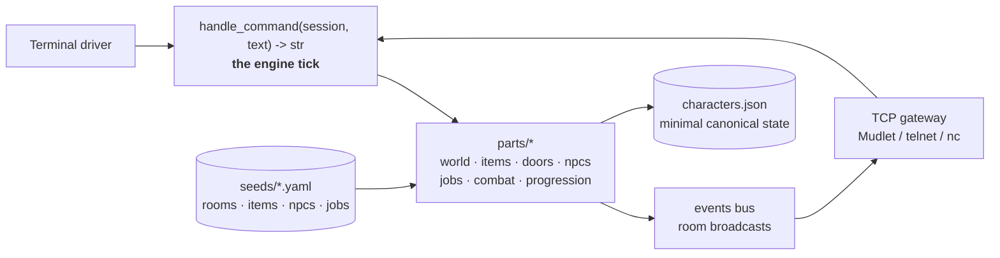

# CodeForge ⚒️

[](https://github.com/MatrymLabs/codeforge/actions/workflows/ci.yml)

**A Python-native multiplayer MUD engine, built as a workshop of small, tested, reusable parts.**

Classic soul: rooms, exits, keys, locked doors, NPCs, callings, XP, a training dummy
that reassembles itself. Modern body: a pure-function engine tick, a broadcast event
bus, YAML-seeded worlds, deterministic combat math, restart-surviving characters, and
a threaded TCP gateway that real MUD clients (Mudlet, telnet, nc) connect to today.

```text
== matrym, the Vanguard ==
Level 2   XP 90 / 150
HP 39/39   MP 11/11
agility 8   magic 4   stamina 12   strength 14
```

## Quick start

```bash
git clone git@github.com:MatrymLabs/codeforge.git
cd codeforge
python3 -m venv .venv && source .venv/bin/activate
pip install -e ".[dev]"
make check     # lint + typecheck + full test suite
make run       # play solo in the terminal
```

### Multiplayer

```bash
make serve     # gateway on port 4000
```

Then from any machine on your network: `nc <host> 4000` -- or point **Mudlet**
(or any telnet client) at it. Each connection is a live seat in one shared world:
players see each other arrive, speak, fight, and level up.

```text
> name matrym
Welcome back, matrym.
```

Your name is your login: characters persist across server restarts
(v0 has no passwords -- treat it as a LAN toy, not an internet service).

## Architecture

The engine is a **pure tick** surrounded by thin drivers. Every part is a card:
one module, one job, one test twin.



Three laws hold everywhere:

1. **State is canonical; text is a projection.** Renderers never mutate anything.
2. **The world is data.** Rooms, items, NPCs, and callings are born from YAML seeds,
   validated by loader gates (label rules, duplicate refusal, template merging).
3. **Derive, don't store.** A saved character is four integers; stats and resources
   are recomputed from the job template and growth formulas -- and a parity test
   pins restore-math equal to play-math.

## The card catalog

Generated from the `CARD:` docstrings in `parts/` (see `make store`):

| Card | Purpose |
|---|---|
| `catalog` | the filing system. List world components by number. |
| `characters` | named heroes survive the restart. |
| `combat` | the training loop: strike, defeat, XP, LEVEL UP. |
| `doors` | lockable barriers between rooms. |
| `events` | world happenings broadcast to bystanders. |
| `gateway` | a line-based TCP server sharing one world. |
| `items` | objects, containment, take/drop/inventory. |
| `jobs` | callings born from seed, characters born from callings. |
| `npcs` | characters who live in rooms and talk. |
| `progression` | XP and JP level curves (locked design, July 2026). |
| `resources` | bounded depleting values (HP, MP, TP). |
| `save` | snapshot persistence for world state. |
| `seed` | load and validate world component packs from YAML. |
| `session` | one player's connection state. |
| `stats` | validated, immutable character statistics. |
| `store` | the hardware store inventory. List engine parts and purposes. |
| `world` | world graph, direction aliases, movement. |

Salvage note: `stats`, `resources`, and `progression` were ported from an earlier
Evennia-based prototype -- framework-free kernel code survived the framework it was
written for, original tests included.

## Workshop buttons

| Command | What it does |
|---|---|
| `make fix` | Auto-format and auto-fix lint |
| `make check` | Lint, typecheck (mypy), full pytest suite |
| `make coverage` | Test coverage report |
| `make audit` | Dependency vulnerability scan |
| `make run` | Solo terminal play |
| `make serve` | Multiplayer TCP gateway (Ctrl+C to sleep the world) |
| `make world` | Operator catalog of rooms / items / NPCs |
| `make store` | Developer catalog of cards and their test twins |
| `make ship` | Full check, refuse dirty tree, push |

## Testing

125 tests and counting: unit twins for every card, real-socket gateway tests,
engine-tick wiring tests, deterministic combat math, persistence parity, and
Hypothesis property tests pinning the progression curves ("XP costs never
decrease") across thousands of generated cases. CI runs the same `make check`
as the workbench.

## Roadmap

- NPCs that fight back (stakes, defeat, reawakening)
- Permission ranks and wizard verbs (`@shutdown`, `@teleport`, `@dig`)
- Accounts with real password hashing
- Canonical event frames (typed MUD-IL payloads on the bus)
- Seed packs as installable world modules

## License

MIT -- see [LICENSE](LICENSE).
