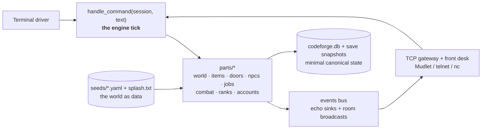

# CodeForge ⚒️

[](https://github.com/MatrymLabs/codeforge/actions/workflows/ci.yml)


[](https://codecov.io/gh/MatrymLabs/codeforge)

**A Python-native multiplayer MUD engine, built as a workshop of small, tested, reusable parts.**

Classic soul: an ASCII splash screen, rooms, locked doors, NPCs, callings, XP, wizards,
and a training dummy that reassembles itself. Modern body: a pure-function engine tick,
account authentication with salted pbkdf2 hashing, a broadcast event bus, YAML-seeded
worlds, restart-surviving characters, rank-gated admin verbs, and a threaded TCP gateway
that real MUD clients (Mudlet, telnet, nc) connect to today.


```text
=========================================================
            T H E   F I R S T   F O R G E
=========================================================
Character (character@account), NEW, or GUEST: matrym@matlabs
Password: ********
Welcome back, Matrym@matlabs.

> @shutdown
The world is going to sleep. Your deeds are remembered.
```

## Quick start

```bash
git clone git@github.com:MatrymLabs/codeforge.git
cd codeforge
python3 -m venv .venv && source .venv/bin/activate
pip install -e ".[dev]"
make check       # lint + typecheck + 191 tests
spark            # ignite the multiplayer server on port 4000
```

Connect from any machine on your network with `nc <host> 4000`, telnet, or **Mudlet**.
Every connection meets the front desk: log in as `character@account`, register a new
legend, or wander in as a guest. Characters persist across restarts; passwords are
salted pbkdf2 hashes; ranks gate the wizard verbs (`@teleport`, `@grant`, `@shutdown`).

More doors: `codeforge play` (solo terminal), `codeforge grant <name> <rank>`,
`codeforge migrate <char> <account>`.

## Architecture

The engine is a **pure tick** surrounded by thin drivers. Every part is a card:
one module, one job, one test twin. See [docs/architecture.md](docs/architecture.md).



Three laws hold everywhere:

1. **State is canonical; text is a projection.** Renderers never mutate anything.
2. **The world is data.** Rooms, items, NPCs, callings, and even the login splash are
   born from seed files, validated by loader gates.
3. **Derive, don't store.** A saved character is a handful of integers; stats and
   resources recompute from job templates and growth formulas, with a parity test
   pinning restore-math equal to play-math.

## The card catalog

Generated from the `CARD:` docstrings in `parts/` (see `make store`):

| Card | Purpose |
|---|---|
| `accounts` | names become logins with real password hashing. |
| `catalog` | the filing system. List world components by number. |
| `characters` | named heroes survive the restart. |
| `cli` | one door to the whole workshop: the codeforge command. |
| `combat` | the training loop: strike, defeat, XP, LEVEL UP. |
| `doors` | lockable barriers between rooms. |
| `events` | world happenings broadcast to bystanders. |
| `gateway` | a line-based TCP server sharing one world. |
| `items` | objects, containment, take/drop/inventory. |
| `jobs` | callings born from seed, characters born from callings. |
| `npcs` | characters who live in rooms and talk. |
| `progression` | XP and JP level curves (locked design, July 2026). |
| `ranks` | authority, and the wizard verbs it makes legal. |
| `regulations` | `regs` — reference federal guidance from the Guidance Library while you build. |
| `resources` | bounded depleting values (HP, MP, TP). |
| `save` | snapshot persistence for world state. |
| `seed` | load and validate world component packs from YAML. |
| `session` | one player's connection state. |
| `stats` | validated, immutable character statistics. |
| `store` | the hardware store inventory. List engine parts and purposes. |
| `world` | world graph, direction aliases, movement. |

Salvage note: `stats`, `resources`, and `progression` were ported from an earlier
Evennia-based prototype -- framework-free kernel code survived the framework it was
written for, original tests included.

## Workshop buttons

| Command | What it does |
|---|---|
| `make env` | Create/validate the `.venv` and install dev deps (fails loud on Python < 3.13) |
| `make fix` / `make check` | Auto-fix, then lint + mypy + tests + property tests |
| `make test` / `make property` | Deterministic suite / Hypothesis property tests, run separately |
| `make coverage` / `make security` | Coverage report (85% floor) / bandit SAST + dependency CVE scan |
| `make doctor` | Run every gate read-only, stop at the first failure, and prescribe the fix |
| `make patch` | Scan deps for CVEs, apply available security fixes (`pip-audit --fix`), then re-verify + file dated evidence |
| `make daily` | Apply security patches (+re-verify), then check federal guidance for updates and file them in the [Guidance Library](https://github.com/MatrymLabs/federal-guidance-library) (`FGL_HOME`) |
| `spark` · `codeforge serve` | Multiplayer gateway (Ctrl+C sleeps the world) |
| `codeforge play` | Solo terminal session |
| `make world` / `make store` | Operator catalog / developer card catalog |
| `make unskew` | Reset tracked-file timestamps (clock-skew cure) |
| `make ship` | Full check, refuse dirty tree, push |

## Testing

191 tests: unit twins for every card, real-socket gateway tests that walk the login
dialogue over the wire, engine-tick wiring tripwires, deterministic combat math,
persistence parity, security tests (impostor refusal, salted hashes, generic login
refusals), and Hypothesis property tests pinning the progression curves across
thousands of generated cases. CI runs the same `make check` as the workbench.

## Roadmap

- Password change command + telnet echo masking (IAC negotiation)
- NPCs that fight back: stakes, defeat, reawakening
- Canonical event frames: typed MUD-IL payloads on the bus
- Seed packs as installable world modules

## Contributing

See [CONTRIBUTING.md](CONTRIBUTING.md) for the workshop rituals: conventional commits,
the card/test-twin rule, and the verification gates.

This project was built in AI-assisted sessions with human review at every gate;
[docs/AI_WORKFLOW.md](docs/AI_WORKFLOW.md) documents the guardrails, failure patterns,
and design invariants that governed those sessions.

## License

MIT -- see [LICENSE](LICENSE).
