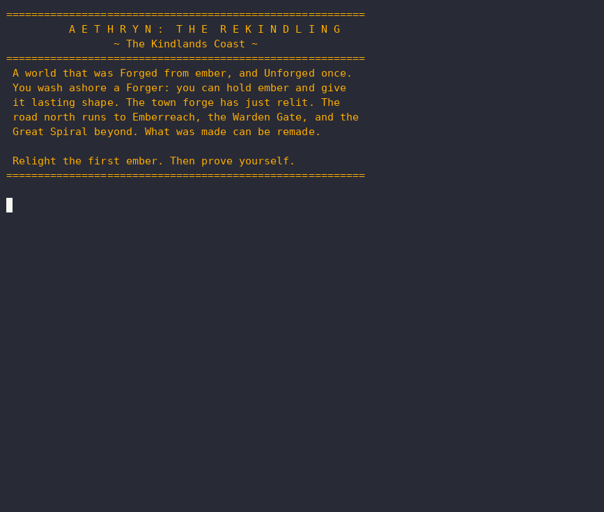
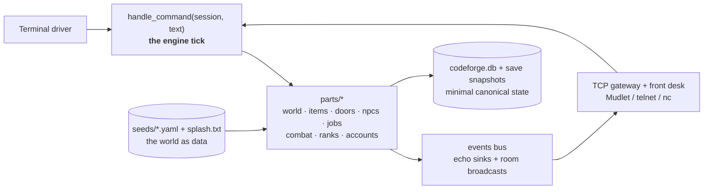

# CodeForge ⚒️

[](https://github.com/MatrymLabs/codeforge/actions/workflows/ci.yml)


[](https://codecov.io/gh/MatrymLabs/codeforge)
[](https://scorecard.dev/viewer/?uri=github.com/MatrymLabs/codeforge)
[](https://matrymlabs.github.io/codeforge/)

**A Python-native software manufacturing platform with two outputs: an installable multiplayer World Package (the MUD you can play in your browser today), and a Hardware Store of reusable parts proven in the game and translated to real software.**



📖 **Documentation site:** [matrymlabs.github.io/codeforge](https://matrymlabs.github.io/codeforge/) (built from `docs/` with MkDocs Material, published on GitHub Pages).

Classic soul: an ASCII splash screen, rooms, locked doors, NPCs, callings, XP, wizards,
and a training dummy that reassembles itself. Modern body: a pure-function engine tick,
account authentication with salted pbkdf2 hashing, a broadcast event bus, YAML-seeded
worlds, restart-surviving characters, rank-gated admin verbs, a threaded TCP gateway
that real MUD clients (Mudlet, telnet, nc) connect to today, and a browser gateway you
can click straight into.

> **The vision, honestly labelled:** CodeForge is being assembled as a two-output manufacturing
> platform - a **World Package** generator (the MUD is the first, and it runs today) and a
> reusable-parts **Hardware Store** (parts proven in the game, translated to real software:
> government, finance, compliance, records). The engine and its first world work now; the
> manufacturing spine (Blueprint -> parts -> assemble -> test -> catalog -> package) is being
> built one vertical slice at a time. Browse the parts with `make hardware`; read the full plan
> in [`docs/vision_resync.md`](docs/vision_resync.md).
>
> **Proven, not just promised.** The store isn't only a catalog: four of its patterns are
> re-implemented and running in the fleet's industry repos (a retry policy, a circuit breaker, a
> token-bucket rate limiter, and a tamper-evident hash-chained ledger), each harvested in the
> consumer's own voice with recorded provenance - no shared import, zero coupling. The ledger
> earned a standalone release: [`matrym-hashchain`](https://pypi.org/project/matrym-hashchain/) on
> PyPI (MIT, stdlib-only) - `pip install matrym-hashchain`. One pattern, proven in the game, then
> reused in real software and shipped as a package.

```text
=========================================================
          A E T H R Y N :  T H E  R E K I N D L I N G
                 ~ The Kindlands Coast ~
=========================================================
 A world that was Forged from ember, and Unforged once.
 The town forge has just relit. Relight the first ember,
 then prove yourself.
=========================================================
Character (character@account) or NEW: matrym@matlabs
Password: ********
Welcome back, Matrym@matlabs.

> @shutdown
The world is going to sleep. Your deeds are remembered.
```

## Play in your browser 🌐

### ▶ [**Play the live demo**](https://codeforge-demo-1kcu.onrender.com/)

No install - just click and log in (`NEW` to make a character). It's on a free tier that
sleeps when idle, so the **first load may take ~30-60s to wake up**; after that it's instant.

The demo boots **aethryn**, the flagship world: wash ashore on the Kindlands Coast, take a
calling, and walk **the Relighting** - relight the first ember, reforge the Old Reach Bridge,
and face the Cinder-Wight in the Cold Cellar. The whole arc advances from what you actually do.

Or run it locally:

```bash
codeforge web            # serves the browser gate on http://localhost:8000
```

Same engine, a fourth thin driver: an [xterm.js](https://xtermjs.org) terminal speaks to
the tick over a WebSocket. The public demo is deliberately safe - ephemeral state, a seat
cap, and idle timeouts - so a shared link can't be farmed. Deploy your own with the
included [`render.yaml`](render.yaml) (Render → New → Blueprint; no secrets required).

### The readiness dashboard 📊

```bash
codeforge api            # serves the FastAPI app on http://localhost:8000
```

`GET /` is a server-rendered dashboard that projects the forge's own evidence, the career
board, the QualityGate audit, the hardware store, and the latest `make bench` run, onto one
accessible, responsive page. It is **enhanced with HTMX** (vendored, no JS build, no CDN): a
live **Refresh** re-computes the board with no page reload, and clicking a **Blueprint**
renders it in-page - all as progressive enhancement (the page works with JavaScript off). The
same data is served as typed JSON at `/api/status` (the seam a future React/TypeScript front
end would consume, documented in OpenAPI at `/docs`). See [`docs/dashboard.md`](docs/dashboard.md).

## Full-Stack Forge Direction 🧭

CodeForge is **architecture-first Python**: frameworks are professional tools that must earn
their place, not an identity to avoid. The custom tick stays the core; FastAPI carries the
web layer it already carries; Django, Evennia, and React are researched, deferred options.
The decision and the scored matrix live in
[`docs/full_stack_forge_decision.md`](docs/full_stack_forge_decision.md) and
[`docs/framework_decision_matrix.md`](docs/framework_decision_matrix.md).

The first net-new spine is the **Blueprint renderer**: an idea becomes a validated Blueprint
(JSON record + Markdown twin), then a static HTML page, all frameless.

```bash
codeforge play           # then, in the MUD:
blueprint list           # every filed plan
blueprint show npc_combat # read the plan as Markdown
blueprint render npc_combat # project it to a static HTML page (reports/blueprints/)
```

See [`docs/blueprint_renderer.md`](docs/blueprint_renderer.md).

## Quick start

```bash
git clone git@github.com:MatrymLabs/codeforge.git
cd codeforge
python3 -m venv .venv && source .venv/bin/activate
pip install -e ".[dev]"
make check       # lint + typecheck + the full test suite
spark            # ignite the multiplayer server on port 4000
```

Connect from any machine on your network with `nc <host> 4000`, telnet, or **Mudlet**.
Every connection meets the front desk and must authenticate: log in as
`character@account`, or register a new legend with `NEW` - there is no anonymous access.
Characters persist across restarts; passwords are salted pbkdf2 hashes and hidden at the
prompt (telnet echo blackout); ranks gate the wizard verbs (`@teleport`, `@grant`,
`@shutdown`).

More doors: `codeforge play` (solo terminal), `codeforge grant <name> <rank>`,
`codeforge migrate <char> <account>`. The full operator's guide - starting the
servers, the login flow, and the one-command **ritual** - is
[docs/RUNNING.md](docs/RUNNING.md).

### The ritual

One command lights the whole workshop and drops you at the front desk - gates run,
GitHub mirrors, the forge lights, the MUD window opens; its counterpart secures
everything at day's end:

```bash
make ritual        # or, bound as a phrase: start the ritual
make ritual-down   # or: complete the ritual   (bank the forge, muster report)
```

Login uses a bundled stdlib client (`scripts/mud_client.py`) that hides your
password even where `telnet` isn't installed.

### A seed is a game

The engine boots one **seed pack** (a whole world: rooms, items, NPCs, callings,
splash) at startup - swap the seed and you're playing a different game on the same
engine. The spawn point is the first room in the seed, so nothing is hardcoded.

```bash
codeforge seeds                       # list installed games
codeforge play --seed aethryn         # the flagship world (the Kindlands Coast)
codeforge play --seed spiral-ascent   # or the Spiral Ascent
FORGE_SEED=aethryn spark              # same selector for the multiplayer server
```

Shipped seeds: **`aethryn`** (the flagship, and the world the live demo boots),
`first-forge` (the fantasy starter), and `spiral-ascent`. In aethryn you walk a full
story arc, **the Relighting**: relight the first ember, reforge the broken Old Reach
Bridge, and end the cold in the Cold Cellar. It plays from real actions - pick up the
ember and it relights, walk into the cellar and you delve it, fell the Cinder-Wight and
the story ends - because the quest, its doors, and their triggers are all **seed data**,
not Python. Adding a new game (or a new arc) is a new `seeds/<name>/` folder of YAML.

A **seed pack** is a game's *content* (above). A **cast** is the next layer: a standalone,
installable project poured from the forge - the engine + one chosen seed pack + config,
detached into its own repo. *"CodeForge is the forge; a cast is what leaves it."* The
Phase-1 scaffold plans a cast (dry run - writes nothing):

```bash
make cast-plan TEMPLATE=fantasy_mud NAME=Aethris   # what a cast WOULD copy, and never copy
```

See [docs/seed_architecture.md](docs/seed_architecture.md) for the doctrine and the phased
plan (whole-engine copy today; module-level selection is Phase-2 decoupling work).

## Architecture

The engine is a **pure tick** surrounded by thin drivers. Every part is a card:
one module, one job, one test twin. See [docs/architecture.md](docs/architecture.md).



Three laws hold everywhere:

1. **State is canonical; text is a projection.** Renderers never mutate anything.
2. **The world is data.** Rooms, items, NPCs, callings, and even the login splash are
   born from seed files, validated by loader gates.
3. **Derive, don't store.** A saved character is a handful of integers; stats and
   resources recompute from job templates and growth formulas, with a parity test
   pinning restore-math equal to play-math.

## Engineering systems

Beyond the game, the parts compose into a self-auditing engine. Every command below
is real, tested, and reachable in the MUD:

- **Classification Registry** - a hidden filing system: every object carries a
  designation (`TYPE-DD.NNN`) keyed to its runtime label. `registry show
  <id>`, `registry type CMD`. See [docs/classification/](docs/classification/CLASSIFICATION_SYSTEM.md).
- **Command spine** - namespaced (`CORE` / `ADMIN @` / `SEED`), rank-gated verbs; a
  seed can never shadow a reserved word.
- **Safety + QA** - `qa gate all` grades every filed object (purpose · file · tests ·
  docs · maturity); `safety review <id>` rates risk. Readiness only - no compliance
  claims. See [docs/safety_qa_system.md](docs/safety_qa_system.md).
- **Project control** - `pm status` computes the dashboard from the registry + the QA
  gate (no stored copy to drift). See [docs/project_management.md](docs/project_management.md).
- **Guidance Library** - `library` / `library <id>` read the Federal Guidance
  Library's stored documents read-only; `regs <id>` cites tracked sources.
- **Compliance awareness** - `law` / `law <id>` render tracked sources through a
  legal-*awareness* boundary: never legal advice, always "human review required."
  See [docs/legal_policy_awareness.md](docs/legal_policy_awareness.md).
- **System generation** - `@sg item <pattern>` forges a filed item pattern (wizard+,
  data-driven, refuses the unknown).

The whole flow runs green end-to-end via `make smoke` (start → log in → look → check
→ do → log out → bank the forge). The startup ritual audits it (`make readiness`).

## What this demonstrates

Reading this repo, an engineer can *verify*, not take on faith, these skills:

- **Architecture** - a pure-function engine tick (`handle_command`) with thin drivers
  (terminal · TCP · WebSocket); state is canonical, text is a projection. See
  [docs/architecture.md](docs/architecture.md).
- **Testing discipline** - unit twins per card, property-based (Hypothesis), real-socket
  + WebSocket integration, an end-to-end `make smoke`, restore/play parity: the full
  suite runs green on every merge (the CI badge is the live source of truth).
- **Self-auditing systems** - a classification registry, `qa gate all`, and `pm status`
  compute readiness from filed data (part + part); the startup ritual runs a security +
  registry self-check *before* it lights the forge.
- **Security posture** - rank-gated admin verbs, salted pbkdf2 auth, an allowlisted
  command runner (never raw shell), SAST (bandit + CodeQL) + dependency scanning
  (pip-audit) + secret scanning (detect-secrets) + a CycloneDX SBOM + Dependabot.
- **Delivery mechanics** - CI + Docker + a live browser demo + Conventional Commits + a
  CHANGELOG; every merge green.
- **Systems thinking (20 yrs USAF)** - readiness checks, evidence trails, controlled
  changes, QA gates - mission-system discipline applied to software.

Everything above is **working and tested.** Planned work is marked as such in the
[roadmap](#roadmap).

**Skills → proof, in the MUD:** the `career` command (in *The Forge Workshop*) renders a
**Career Evidence Sign** - real software-career skills mapped to the exact repo artifact
that proves each, grounded in BLS/O*NET research. `career gaps` lists what's still missing.
It obeys VeritasGate: a skill is only "proven" when its cited artifact actually exists. See
[docs/career_evidence_board.md](docs/career_evidence_board.md) and
[docs/resume_mapping.md](docs/resume_mapping.md).

**Bold, but honest:** `pioneer` surfaces **Pioneer Mode** - a disciplined-Maverick framework
(*bend convention, not truth/safety/trust*) with a risk ladder, a constraint-review template,
and filed experiment reports. See [docs/pioneer_mode.md](docs/pioneer_mode.md).

**One pane of glass:** `inspect` (inspect the forge) composes every self-audit signal -
registry · QA board · truth · docs · overclaims · career · pioneer - into one on-demand
green/yellow/red **frame-up** of the whole machine. See [docs/frame_up.md](docs/frame_up.md).

**How it's built - honestly:** AI-assisted and engineering-directed. AI expands the
creative and analytical surface; the ritual, gates, and self-audit keep it honest;
tests and evidence prove each claim; I direct, review, and make the calls. What makes
this *engineering* and not "AI wrote it" is the same thing that proves any engineering -
the tests, the gates, and the green CI you can run yourself.

## Evaluation

Don't take the claims above on faith - **run the scorecard.**
[**forge-audit**](https://github.com/MatrymLabs/forge-audit) is a separate proof-tool that
runs the quality gates on any repo (with the repo's *own* toolchain) and emits a verdict
graded against objective stage thresholds. CodeForge passes at the **advanced** stage (the
highest bar: coverage floor 85%), every dimension green. The **verdicts are the tool's own** -
the evidence column just softens volatile numbers to the live badges, so nothing here can
silently drift. Regenerate it yourself:

```
$ forge-audit --path ./codeforge --stage advanced --online --format md
```

### forge-audit - codeforge (advanced stage)

| Dimension | Verdict | Evidence |
|---|---|---|
| lint | ✅ pass | clean |
| typecheck | ✅ pass | clean |
| tests | ✅ pass | green suite, coverage above the 85% floor (the codecov badge is the live source) |
| security | ✅ pass | clean |
| dependencies | ✅ pass | clean |
| ci | ✅ pass | multiple workflow files (`ci`, `codeql`, `docs`, `scorecard`) |
| collaboration | ✅ pass | a real issue -> PR -> merge history ([#160](https://github.com/MatrymLabs/codeforge/issues/160) -> [#161](https://github.com/MatrymLabs/codeforge/pull/161)) |
| performance | ✅ pass | a `benchmarks/` directory (and `make bench` / `make trend` record engine-tick timings) |
| readme | ✅ pass | covers purpose, install, run, test |
| **overall** | **✅ pass** | role signals: testing · security · backend · devops · collaboration · performance · documentation |

Grading yourself by a rule you don't get to bend is the whole point: an earlier version of
this table showed `ci` as a `watchlist` with a single workflow file, so the repo added the
gates the tool was asking for rather than argue with it.

## The card catalog

Generated from the `CARD:` docstrings in `parts/` (see `make store`):

| Card | Purpose |
|---|---|
| `accounts` | names become logins with real password hashing (SQL-backed). |
| `api` | an HTTP window onto the canonical world (FastAPI). |
| `architect` | the Architect NPC: an advisory AI pair-programmer (read-only). |
| `assessment` | the AssessmentEngine: a data-driven question engine. |
| `blueprint` | the Blueprint: a software idea forged into a validated spec. |
| `blueprint_render` | project a Blueprint to a static HTML/CSS page. |
| `catalog` | the filing system. List world components by number. |
| `characters` | named heroes survive the restart (SQL-backed). |
| `classroom` | Professor Codex and the Classroom of Practical Arts. |
| `cli` | one door to the whole workshop: the codeforge command. |
| `combat` | the training loop: strike, defeat, XP, LEVEL UP. |
| `commands` | the command spine: verbs filed, rank-gated, namespaced. |
| `config` | one typed, validated view of the environment (pydantic Settings). |
| `console` | the FailsafeRunner: run allowlisted commands safely. |
| `dashboard` | the Lens: a server-rendered web board over real forge evidence. |
| `db` | persistence through the SQLAlchemy 2.0 ORM (SQLite or PostgreSQL). |
| `doors` | lockable barriers between rooms. |
| `events` | world happenings broadcast to bystanders. |
| `gateway` | a line-based TCP server sharing one world. |
| `generate` | @sg, the system item generator (wizard/owner only). |
| `hardware` | the cross-domain reusable-parts catalog (the hardware store). |
| `items` | objects, containment, take/drop/inventory. |
| `jobs` | callings born from seed, characters born from callings. |
| `library` | read the Federal Guidance Library's preserved documents. |
| `npcs` | characters who live in rooms and talk. |
| `pm` | the project control panel. Composes registry + QualityGate. |
| `progression` | XP and JP level curves (locked design, July 2026). |
| `qualitygate` | the Safety + QA spine. Composes with the registry. |
| `ranks` | authority, and the wizard verbs it makes legal. |
| `registry` | the CodeForge Classification Registry filing engine. |
| `regulations` | reference federal guidance from the Guidance Library. |
| `resources` | bounded depleting values (HP, MP, TP). |
| `save` | snapshot persistence for world state. |
| `seed` | load and validate world component packs from YAML. |
| `session` | one player's connection state. |
| `stats` | validated, immutable character statistics. |
| `store` | the hardware store inventory. List engine parts and purposes. |
| `web_gateway` | the browser gate: play the forge over a WebSocket. |
| `workshop` | the engineering cockpit inside the MUD (display-only). |
| `world` | world graph, direction aliases, movement. |

Salvage note: `stats`, `resources`, and `progression` were ported from an earlier
Evennia-based prototype -- framework-free kernel code survived the framework it was
written for, original tests included.

## The forge voice

The names in this repo are chosen in a deliberate voice - workshop invention,
detective case files, worlds-and-gates - so the code reads like the thing it
models (`spark`, `Forge`, `Session`, `Seed`, the tick as the only *door*). It's a
documented convention with hard limits: **clarity outranks poetry, and the data
contract stays literal** (persisted labels, seed keys, DB columns, and CLI verbs
never take the metaphor). The vocabulary map is in
[`docs/naming_glossary.md`](docs/naming_glossary.md); the philosophy and its
governing boundaries are in [`docs/AI_WORKFLOW.md`](docs/AI_WORKFLOW.md).

## Workshop buttons

**The quality gates form one ladder, not a pile of look-alikes.** `make check` is *the* gate
(CI runs it: lint + types + tests + coverage; green before merge). `make doctor` runs the same
gates diagnostically - read-only, stops at the first failure, prescribes the fix (use it when
`check` is red). `make ritual` is the full ceremony: `check` + security wards + `readiness` +
`truth` + a `repo-integrity` evidence report + an end-to-end `smoke` test. The single-purpose
verifiers - `readiness` (registry + PM), `truth` (claims vs reality), `repo-integrity` (dated
evidence bundle), `smoke` (live socket round-trip) - are the steps the ritual composes; run one
directly when you want just that check.

| Command | What it does |
|---|---|
| `make env` | Create/validate the `.venv` and install dev deps (fails loud on Python < 3.13) |
| `make fix` / `make check` | Auto-fix, then lint + mypy + tests + property tests |
| `make test` / `make property` | Deterministic suite / Hypothesis property tests, run separately |
| `make coverage` / `make security` | Coverage report (85% floor) / bandit SAST + dependency CVE scan |
| `make doctor` | The same gates as `check`, diagnostic: run read-only, stop at the first failure, and prescribe the fix |
| `make patch` | Scan deps for CVEs, apply available security fixes (`pip-audit --fix`), then re-verify + file dated evidence |
| `make daily` | Apply security patches (+re-verify), then check federal guidance for updates and file them in the Guidance Library (a private companion repo, `FGL_HOME`) |
| `spark` · `codeforge serve` | Multiplayer gateway (Ctrl+C sleeps the world) |
| `codeforge play` | Solo terminal session |
| `make ritual` / `make ritual-down` | Light the whole workshop (gates → mirror → forge → MUD) / secure it at day's end |
| `make world` / `make store` | Operator catalog / developer card catalog |
| `make unskew` | Reset tracked-file timestamps (clock-skew cure) |
| `make ship` | Full check, refuse dirty tree, push |

## Testing

A layered suite: unit twins for every card, real-socket gateway tests that walk the login
dialogue over the wire, browser-gateway tests over a real WebSocket, engine-tick wiring
tripwires, deterministic combat math, persistence parity, event-bus resilience (a
dropped client can never crash another player's command), security tests (impostor
refusal, salted hashes, generic login refusals), and Hypothesis property tests pinning
the progression curves across thousands of generated cases. CI runs the same
`make check` as the workbench, plus a `docker` job that builds the image and smoke-tests
that the gateway boots.

> **🔍 Debugging case study.** That "a dropped client can never crash another player's
> command" line has a story: an intermittent, "impossible" crash that only surfaced
> through the launch ritual, cornered with a **PTY reproduction** and fixed at three
> seams. The write-up - symptom → reproduction → root cause → fix → lesson - is in
> **[docs/DEBUGGING.md](docs/DEBUGGING.md)**.

## Roadmap

- ~~Password change command + telnet echo masking (IAC negotiation)~~ - shipped
  (`passwd`, plus a bundled stdlib client that masks the prompt)
- NPCs that fight back: stakes, defeat, reawakening
- Canonical event frames: typed MUD-IL payloads on the bus
- Seed packs as installable world modules
- The workshop: build programs via in-MUD commands, then step through an
  owner-only arch into the proving ground to play the game you built

## Contributing

See [CONTRIBUTING.md](CONTRIBUTING.md) for the workshop rituals: conventional commits,
the card/test-twin rule, and the verification gates.

This project was built in AI-assisted sessions with human review at every gate;
[docs/AI_WORKFLOW.md](docs/AI_WORKFLOW.md) documents the guardrails, failure patterns,
and design invariants that governed those sessions.

## License

MIT -- see [LICENSE](LICENSE).
