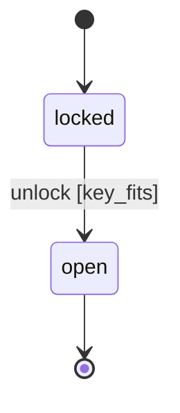

# ADR-0004: State machines are data; effects are applied by the caller

**Status:** accepted

## Context

Many systems in the world model a lifecycle: a door is `locked` or `open`; a quest is
`unstarted`, `active`, `completed`, or `failed`; a training dummy cycles `intact -> damaged
-> destroyed -> reassembling -> intact`; a combat AI moves `idle -> alert -> attacking`.
Written ad hoc, each grows its own tangle of booleans (`is_open`, `is_paid`) whose illegal
combinations become the bugs, and each re-invents the same "is this move allowed?" logic.

We want one reusable part (`parts/statemachine.py`) that every lifecycle composes onto,
without violating the architecture laws: state is canonical and text is a projection
(ADR-0001), records persist minimal facts and derive the rest (ADR-0002), and only validated
engine logic mutates the world.

## Decision

A finite-state machine in CodeForge is **pure data plus a pure decision**:

1. **The machine is data.** A `Machine` is a state set, a start state, and transitions. A
   transition names its guard and its effect as *strings*, not closures, so a machine stays
   serializable and can one day live in a seed. `build()` validates the graph loud and early:
   an off-graph transition or two edges for one `(state, event)` is a construction error.
2. **`advance` decides, it does not act.** It returns `Fired(dst, effect)` for a legal move
   or `Refusal(reason)` for an illegal one. It never renders, never broadcasts, and never
   mutates world state. An unknown event is a refusal, never an exception; a guard that
   raises is caught and reported as a refusal, never a crash.
3. **The caller applies the effect.** `Fired` carries an effect *name*; validated engine logic
   (the calling part) applies it. The machine proposes; the engine disposes. This is what
   keeps "only engine logic mutates" true and keeps the machine trivially testable.
4. **State is derived, not stored twice.** A consumer keeps its own canonical fact and derives
   the machine's state label from it. `parts/doors.py` keeps `locked: bool` and derives
   `"locked"`/`"open"`; the machine never becomes a second, driftable copy of the truth.

### The door machine (the first consumer)

`unlock` is legal only from `locked`, gated by the `key_fits` guard; unlocking an open door
has no edge and is refused. `parts/doors.py` now runs on this machine as the proof of
composability, with its behavior and messages unchanged.

## Consequences

- **Reuse:** doors, quests, combat phases, the self-reassembling dummy, and non-game
  lifecycles (an order, a care pathway, a compliance control's `current -> superseded` status)
  are all instances of one tested part.
- **Testability:** the machine is pure, so legality is unit-tested without a world, a server,
  or a database; a property test pins that `advance` is total and never leaves the graph.
- **Honesty:** illegal moves become explicit refusals with reasons, not silent flag bugs.
- **The accepted cost:** a consumer writes a little wiring (a state derivation, a guard
  registry) instead of an inline `if` chain. The payoff is one inspectable source of legality
  per lifecycle, and a part that composes across the whole Hardware Store.

## Alternatives weighed

- **Machine applies its own effects (callbacks).** Simpler at the call site, but it couples
  the decision to the mutation, makes the machine impossible to test in isolation, and would
  let a part mutate world state from outside validated engine logic. Rejected.
- **States as free booleans (status quo before this ADR).** No shared part, no guard against
  illegal combinations, logic duplicated per system. This ADR exists to retire that pattern.
