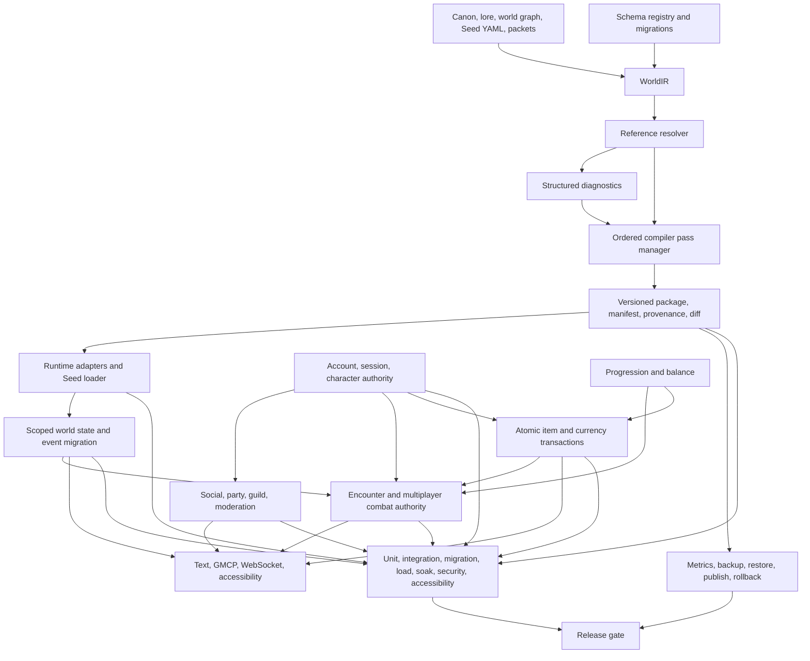

# Aethryn MMORPG Architectural Dependency Graph

Audit commit: `0f6d8ed876876f92fd77eed7caa14b48b6ba5fd7`



## Current implementation mapping

| Node | Current implementation | Status |
| --- | --- | --- |
| Sources | `content/seeds/aethryn/*`, packet YAML, canon and world graph loaders | functional but competing inputs |
| WorldIR | no shared aggregate; packet dataclasses and legacy Seed structures | missing |
| Schema registry | Seed loader gates, dataclasses, material culture validator, Alembic | competing partial systems |
| Reference resolver | distributed packet, Seed, population, quest checks | partial |
| Diagnostics | Aethryn `ValidationIssue`, survey, persistence doctor, release gates | competing partial systems |
| Pass manager | `compile_packet` function | missing as an explicit graph |
| Package | generated records, room batch, manifest, provenance, validation report | functional for packet scope |
| Runtime | `world.py`, `room_batches.py`, Aethryn runtime adapter, engine tick | functional MUD, partial MMO runtime |
| State | climate, scheduler, events, Aethryn state store, quest consequence store | partial |
| Accounts | SQL-backed accounts and gateway dialogue | functional local, not production-ready |
| Social | party, guild, chat, friends, mail, bans | functional local, partial live-service |
| Combat | `combat.py`, boss phases, party reward sharing, encounter log | partial multiplayer |
| Transactions | trade, auction, item stores, coin scalar, mail and guild vault | partial and competing |
| Progression | jobs, levels, abilities, professions, reward formulas | partial |
| Client | Telnet, WebSocket, GMCP, text command spine | partial parity |
| Operations | metrics, logging, backups, deployment, release gate | partial, restore unverified |
| Tests | broad suite and Aethryn focused tests | broad but baseline red and MMO proof incomplete |

## Critical path

The implementation dependency order is:

```text
WorldIR
  -> schema registry
  -> source precedence and normalization
  -> reference resolver
  -> common diagnostics
  -> pass manager
  -> package versioning and semantic diff
  -> player/world migration compatibility
  -> authoritative sessions and transactions
  -> encounters and social authority
  -> client parity
  -> restore and operational proof
```

Do not add large regional content before the first six compiler nodes are proven. Content volume would increase duplicate-authority risk without improving the compiler boundary.
