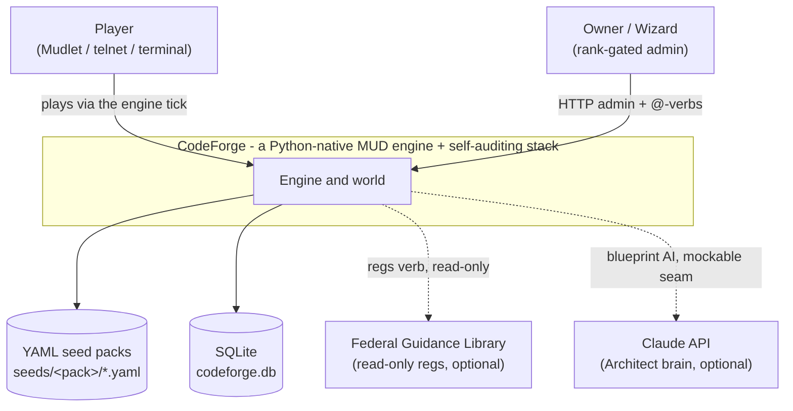
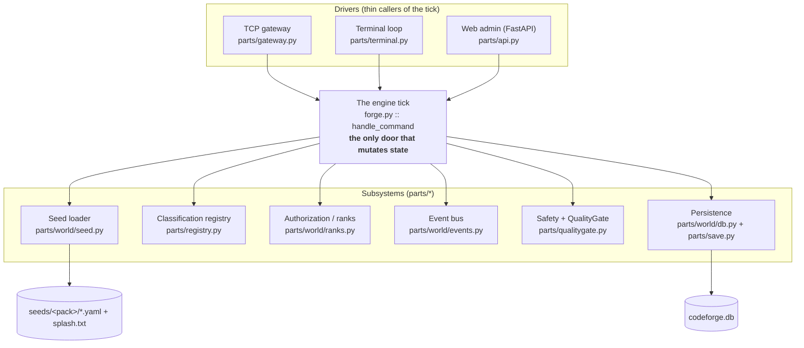

# CodeForge - C4 model view

The [C4 model](https://c4model.com/) describes software at four zoom levels. The two that
carry the most signal are here: **Level 1 (System Context)** shows who uses CodeForge and
what it depends on; **Level 2 (Container)** shows the runnable pieces inside and how one
command flows through them. The prose walkthrough and the design decisions live in
[architecture.md](architecture.md) and [adr/](adr/); this file is the map.

Both diagrams render on GitHub (Mermaid). They are pinned by
`tests/test_architecture_c4.py`: every code module named below must exist on disk, so the
map can never quietly drift from the engine it claims to describe.

## Level 1 - System Context

## Level 2 - Containers

## Containers to code

| Container | Responsibility | Module |
|---|---|---|
| Engine tick | one command in, one response out; the only door that mutates world state | `forge.py` |
| TCP gateway | telnet front desk: authenticate before the world | `parts/gateway.py` |
| Terminal loop | solo local driver | `parts/terminal.py` |
| Web admin | rank-gated FastAPI admin surface | `parts/api.py` |
| Seed loader | validate and load the world from data, failing loud at the gate | `parts/world/seed.py` |
| Classification registry | file every object and module (the tech-order index) | `parts/registry.py` |
| Authorization | rank checks before capability | `parts/world/ranks.py` |
| Event bus | per-player echo sinks and room broadcasts | `parts/world/events.py` |
| Safety + QualityGate | readiness gates before risky actions | `parts/qualitygate.py` |
| Persistence | minimal canonical state; stats recompute on restore | `parts/world/db.py`, `parts/save.py` |

Every module path in this file is asserted to exist by the correspondence test, so a rename
that forgets the map turns the suite red instead of leaving a lie on the page.
