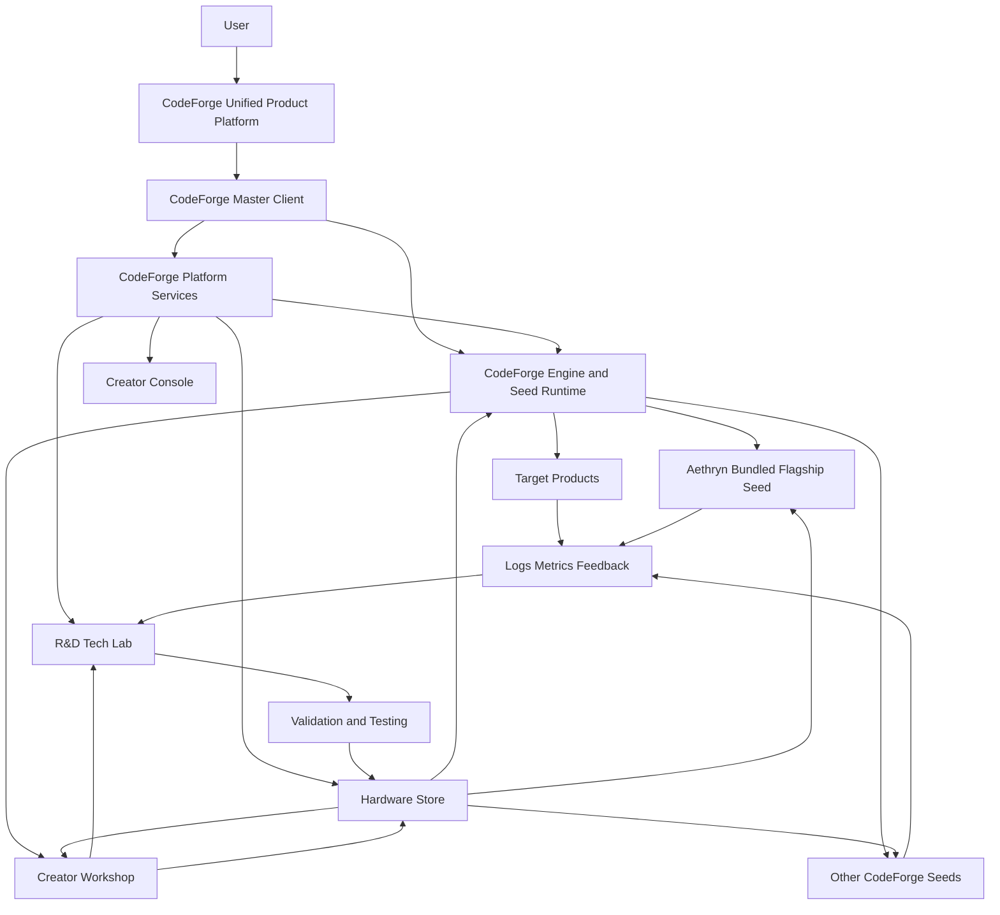

# CodeForge platform startup

The product startup contract is implemented by the Master Client's `codeforge` entry point and
the Engine subsystem's `adapters.cli.main()` together with
`kernel.platform.bootstrap_platform()`. The Engine CLI resolves the Seed before importing the
world. The bootstrap then initializes the existing configuration, identity, persistence,
Hardware Store, isolated R&D audit, Engine, Seed Runtime, Creator Workshop, and operational
API boundary before importing a serving or play driver.

The read-only runtime projection is available at `GET /api/platform/status`. It is the
contract intended for the Master Client and Creator Console; protected operations still use
the existing server-side authorization boundary.

The Engine library retains its historical direct-import default for compatibility. Product
startup resolves Aethryn by default and sets `FORGE_SEED` before the world is imported. An
invalid explicit, active-project, persisted, or environment selection fails clearly and does
not silently substitute another Seed.
